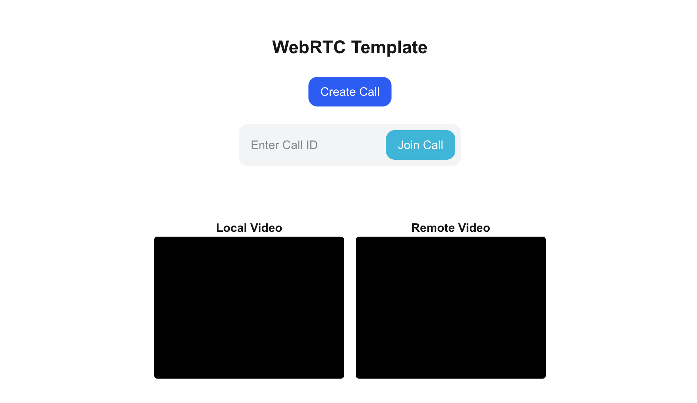

# Next.js WebRTC Template

A simple starter template demonstrating real-time video calling using [WebRTC](https://webrtc.org/) in a [Next.js](https://nextjs.org/) app, with a minimal custom signaling server (Node.js + Socket.IO).



*Example: Video call UI in action*

## Features
- Peer-to-peer video calling using WebRTC
- Simple signaling server for connection setup
- Modern Next.js frontend (React, TypeScript)
- Easy to extend for your own experiments or apps

## How It Works
- The Next.js frontend provides a UI for creating or joining a call.
- When you create or join a call, the app connects to a local signaling server via WebSockets (Socket.IO).
- The signaling server coordinates the WebRTC handshake between peers (offer/answer/candidates).
- Once connected, video streams are sent directly peer-to-peer via WebRTC.

## Getting Started

### 1. Install dependencies

```bash
npm install
# or
yarn install
```

### 2. Start the signaling server

```bash
node signaling-server.js
```

The signaling server runs by default on `http://localhost:3001`.

### 3. Start the Next.js development server

```bash
npm run dev
# or
yarn dev
```

The app will be available at [http://localhost:3000](http://localhost:3000).

## Usage
- Open the app in two browser windows/tabs or on two devices.
- Click "Create Call" to generate a call ID, then share it with your peer.
- The other peer enters the call ID and clicks "Join Call".
- Both peers should see each other's video streams.

## Project Structure
- `src/pages/index.tsx` - Main Next.js page and WebRTC logic
- `signaling-server.js` - Node.js + Socket.IO signaling server

## Customization
- You can extend the signaling server for authentication, rooms, or additional features.
- The frontend is easy to modify for chat, screen sharing, or other RTC features.

## License
MIT
